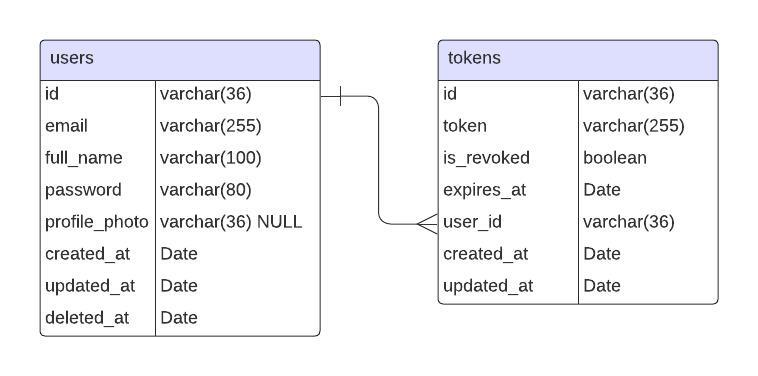

# OrganizeMe

OrganizeMe is a task management application designed to help you organize your daily activities efficiently. Built with Node.js, NestJS, MySQL, and JWT for authentication, OrganizeMe ensures a secure and seamless experience for managing tasks.

## Table of Contents

- [Features](#features)
- [Installation](#installation)
- [Usage](#usage)
- [Database_Diagram](#database-diagram)
- [Configuration](#configuration)
- [License](#license)

## Features

- User authentication and authorization using JWT
- Task creation, editing, and deletion
- Task categorization and prioritization
- Real-time updates
- REST API for easy integration

## Installation

### Prerequisites

- Node.js (v20.15.0 or higher)
- npm (v6 or higher)
- Docker and Docker Compose

### Steps

1. Clone the repository:

    ```sh
    git clone git@github.com:your-username/organize-me-nestjs.git
    cd organize-me-nestjs
    ```

2. Install dependencies:

    ```sh
    npm install
    ```

3. Create a `.env` file based on the `.env.example` file and configure your environment variables:

    ```sh
    cp .env.example .env
    ```

## Usage

### Development

To run the application in development mode:

```sh
npm run start:dev
```

### Production

To run the application in production mode:

```sh
npm run start:prod
```

## Database Diagram

Below is the database diagram for OrganizeMe, detailing the structure and relationships between the users and tokens tables:



## Configuration

The application can be configured using environment variables. Update your `.env` file accordingly:

```env
JWT_SECRET=""

DB_HOST=""
DB_USER=""
DB_PASSWORD=""
DB_NAME=""
DB_TYPE=""

API_PORT=""
DB_PORT=""
ADMINER_PORT=""
```

## License

This project is licensed under the MIT License. See the [LICENSE](LICENSE) file for details.
